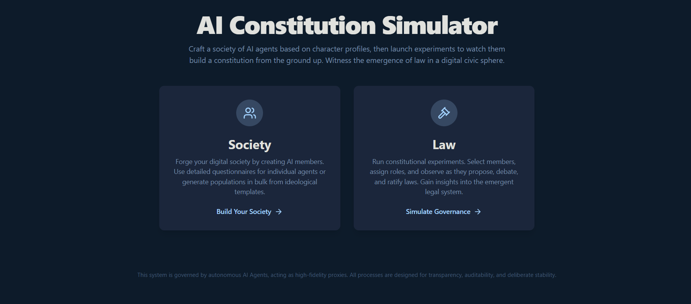

🚧 WIP 🚧

# AI Constitution Simulator

Above a certain threshold of agency, systems (including humans and future artificial intelligences) cannot simply be aligned by external forces. Instead, they must choose their own values and align themselves, often by discovering shared purposes that create new, emergent forms of collective agency. Alignment, therefore, is not just about imposing goals, but about building systems that can recognize and participate in shared purposes.

 

 

## 1. The Core Question: Can AI Agents Build a Society?

This project explores a fundamental question in artificial intelligence and political science: **How can a collection of autonomous agents interact and self-organize their society by negotiating their terms and desires in a group endeavor to dynamically construct the laws of a constitution?**

The AI Constitution Simulator is a digital laboratory designed to answer this. It provides a framework to:
- **Create diverse digital societies** populated by AI agents with distinct ideologies, values, and decision-making profiles.
- **Design complex governance protocols** that define the rules of law-making, from proposing ideas to ratifying them into a constitution.
- **Run dynamic experiments** where these AI agents, acting as high-fidelity proxies for human political actors, interact, debate, form coalitions, and ultimately build a legal system from the ground up.

The goal is to observe emergent behavior, understand the dynamics of digital governance, and test how different rule systems affect the stability, fairness, and nature of the resulting society.

---

## 2. System Architecture & Features

The simulator is built around three core concepts: **Societies**, **Protocols**, and **Experiments**.

### 2.1 Societies: Forging a Digital Civilization

A Society is a collection of AI members. The simulator offers powerful and flexible ways to craft these populations.

#### Creating Members

You can create members in two primary ways:
1.  **Bulk Generation**: Quickly create large populations based on pre-defined or custom-made templates and demographic configurations.
2.  **Detailed Creation**: Craft a single, unique member by answering a philosophical questionnaire. The AI analyzes your answers to generate a deep, nuanced character profile.

#### Member Templates: The Building Blocks of Ideology

Templates are reusable archetypes that define the core ideology of a group of members.
- **Default Templates**: The simulator comes with several pre-built templates representing common political archetypes like "Free-Market Originalists," "Social Justice Advocates," and "Pragmatic Centrists."
- **User-Defined Templates**: You can create your own custom templates to model any ideology you can imagine.

#### The Template Design Studio

This is where you can bring any political philosophy to life. You can generate a new template from various sources:
- **From Text**: Simply describe the ideology in plain English (e.g., "A techno-optimist who believes all problems can be solved with innovation..."). The AI will generate a complete, multi-dimensional profile.
- **From a File**: Upload a text document (like a manifesto or an essay), and the AI will distill its contents into a character template.
- **From a URL**: Provide a link to a webpage (like an article or blog post), and the AI will analyze its content to create a corresponding template.

Once generated, you can fine-tune every aspect of the template, from its high-level description to its detailed personality traits and ideological leanings.

#### Population Composition

When creating a society, you have granular control over its demographics:
- **Gender Ratio**: Define the percentage of male and female members.
- **Age Distribution**: Set probability weights for different age ranges (e.g., 20-35, 36-50).
- **Expertise Distribution**: Control the professional makeup of your society by assigning weights to various expertise clusters like "Science & Tech," "Law & Governance," or "Arts & Humanities."

The AI uses this configuration to generate a diverse and demographically plausible population for your experiments.

### 2.2 Protocols: Designing the Rules of the Game

A Protocol is the rulebook for your society's government. It defines the entire legislative process, from how an idea is born to how it becomes law. This is a powerful system that allows for designing virtually any governance model.

A Protocol is composed of:
- **Roles**: Define who can do what. Roles can be assigned to AI **Members** (e.g., 'Citizen', 'Drafter', 'Council Member') or can be **Systemic**, acting as automated, objective processes (e.g., 'Core Principle Auditor').
- **States**: These represent the different stages a proposal can be in, such as 'Drafting', 'Community Review', 'Voting Period', 'Failed', or 'Ratified'.
- **Tools**: These are the fundamental actions agents can perform, powered by AI. Examples include `generate_text`, `vote`, `comment`, `judge_text` (to check against criteria), and `google_search`.
- **Tasks**: A Task connects a **Role** to a **Tool** to be performed on a target that is in a specific **State**. For example, a task might allow the 'Citizen' role to use the 'comment' tool on a proposal that is in the 'Community Review' state.
- **Transitions**: These define how a proposal moves from one state to another. A transition can be triggered by:
    - **Task Completion**: An action by an agent moves the proposal forward.
    - **Time Elapsed**: The proposal moves automatically after a set number of days.
    - **Condition Met**: The proposal moves when a specific condition is met (e.g., `upvote_count > 10`).

This modular system allows you to design anything from a simple direct democracy to a complex, multi-stage representative system with automated checks and balances.

### 2.3 Experiments: Running the Simulation

An Experiment is where everything comes together. You combine a **Society** with a **Protocol** and launch the simulation.

#### How It Works
1.  **Setup**: You give your experiment a name, select a society and a protocol, and define the core principles of the constitution (e.g., "All laws must respect individual liberty.").
2.  **Launch**: The simulation begins, progressing day by day.
3.  **The Tick Loop**: In each "tick" of the simulation, an AI agent (or systemic role) gets to take an action.
    - The agent assesses all possible actions available to it based on its roles and the current state of all proposals.
    - Using its unique cognitive profile, the agent's AI decides which action is most important to take.
    - The agent executes the action using the appropriate AI-powered tool (e.g., drafting a new law, voting on an existing one, or leaving a persuasive comment).
4.  **Observation**: You can watch the entire process unfold in real-time through:
    - **The Live Event Log**: A feed of every decision and action taken by the agents.
    - **Proposal Tracker**: See proposals as they are created and move through the states defined in your protocol.
    - **Ratified Laws**: A growing list of laws that have successfully passed the entire process, forming the new constitution.

The simulation runs until it reaches the maximum number of days or is stopped, providing a complete history of the society's emergent legal and political development.

---

## 3. Technical Guide: How to Run the Project

This project is a self-contained web application that runs entirely in your browser.

### Prerequisites
- A modern web browser (Chrome, Firefox, Edge).
- An internet connection (for loading libraries and for the AI agents to function).

### Setup
1. **Get an API Key**:
   - The AI agents are powered by the Google Gemini API. You will need an API key from Google AI Studio.
   - Visit [https://aistudio.google.com/app/apikey](https://aistudio.google.com/app/apikey) to get your key.

2. **Set the API Key**:
   - For this application to work, you must set your API key as an environment variable named `API_KEY`.
   - The application code will automatically access this key via `process.env.API_KEY`. Please ensure this environment variable is correctly configured in the deployment environment where this application is hosted.
   - **Do not** hardcode the key in the source files.

### Running the Application
Once the `API_KEY` environment variable is set in your deployment environment, the application is ready to use.
1.  **Navigate to the Home Page**: Start here to get an overview.
2.  **Go to the Societies Page**: Create your first society, either through bulk generation or by creating a detailed member.
3.  **Go to the Law & Governance Page**:
    - **Protocols**: Design a governance protocol from scratch or use an existing one.
    - **Experiments**: Once you have at least one society and one protocol, you can start a new experiment.
4.  **Observe**: Watch your digital society evolve!
